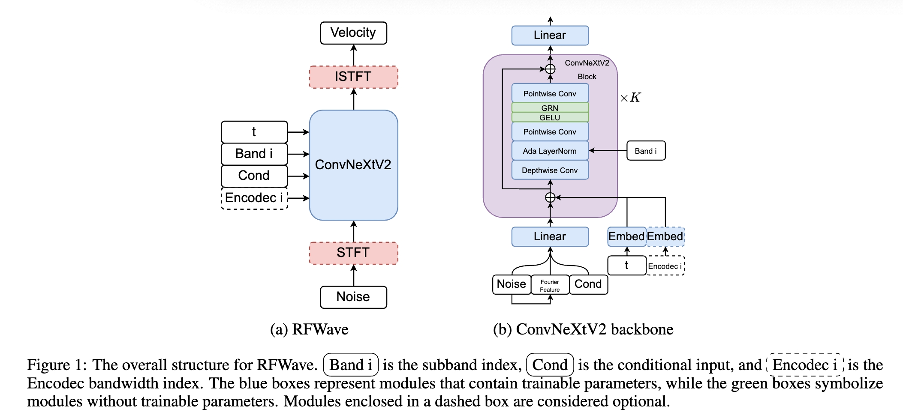
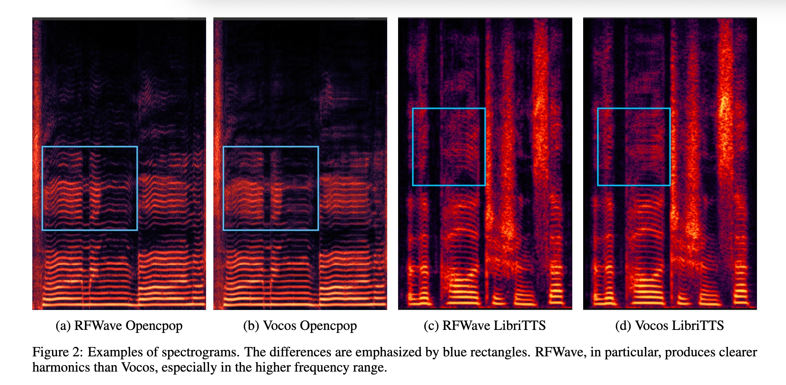

# RFWave: Multi-band Rectified Flow for Audio Waveform Reconstruction.
[Audio samples](https://bfs18.github.io/rfwave/) | [Paper]()

### TL;DR
RFWave is a diffusion-based vocoder. It can generate high-quality audio waveforms from Mel-spectrograms at a speed that is 90 times quicker than real-time on an Nvidia 4090. 

### Abstract
Recent advancements in generative modeling have led to significant progress in audio waveform reconstruction from diverse representations.
Although diffusion models have been used for reconstructing audio waveforms, they tend to exhibit latency issues because they operate at the level of individual sample points and require a relatively large number of sampling steps.
In this study, we introduce RFWave, a novel multi-band Rectified Flow approach that reconstructs high-fidelity audio waveforms from Mel-spectrograms.
RFWave is distinctive for generating complex spectrograms and operating at the frame level, processing all subbands concurrently to enhance efficiency. 
Thanks to Rectified Flow, which aims for a flat transport trajectory, RFWave requires only 10 sampling steps.
Empirical evaluations demonstrate that RFWave achieves exceptional reconstruction quality and superior computational efficiency, capable of generating audio at a speed 90 times faster than real-time.

     
    
    
     

## Usage

### Setup
1. Install the requirements.
2. Download and extract the [LJ Speech dataset](https://keithito.com/LJ-Speech-Dataset/)
3. Update the wav paths in filelists `sed -i -- 's,LJSPEECH_PATH,ljs_dataset_folder/wavs,g' LJSpeech/*.filelist`
4. Update the `filelist_path` in configs/*.yaml.

### Vocoder
1. Train a vocoder `python3 train.py -c configs/rfwave.yaml`
2. Test a trained vocoder with `inference_voc.py`
### Encodec Decoder
1. Train an Encodec Decoder `python3 train.py -c configs/rfwave-encodec.yaml`
### Text to Speech
1. Download the [alignment](https://drive.google.com/file/d/1WfErAxKqMluQU3vupWS6VB6NdehXwCKM/view) from the [SyntaSpeech repo](https://github.com/yerfor/SyntaSpeech)
2. Convert the alignments and build a phoneset with `scripts/ljspeech_synta.py`
3. Modify the `filelist_path` and `phoneset` path in `configs/rfwave-dur.yaml` and `configs/rfwave-tts-ctx.yaml`
4. Train a duration model `python3 train.py -c configs/rfwave-dur.yaml`
5. Train an acoustic model `python3 train.py -c configs/rfwave-tts-ctx.yaml`
6. Test the trained model with `inference_tts.py`

## Pre-trained models
Coming soon

## Thanks

This repository uses code from [Vocos](https://github.com/gemelo-ai/vocos), [audiocraft](https://github.com/facebookresearch/audiocraft) 
